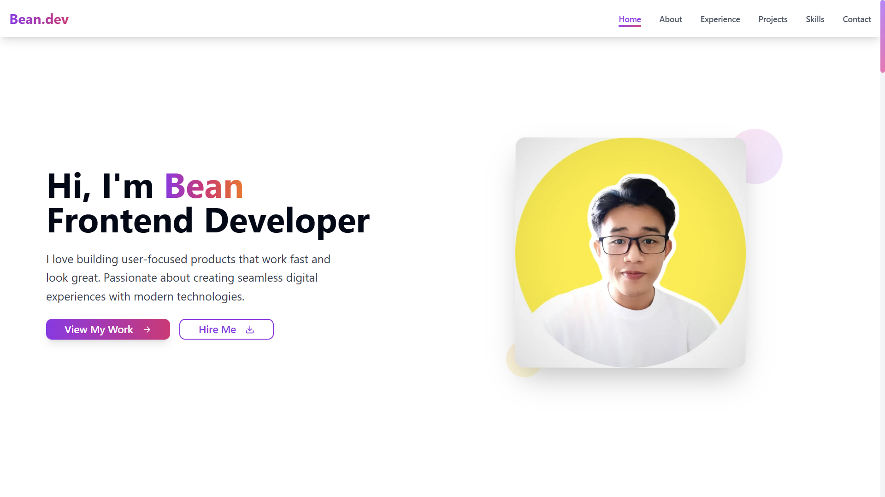

# 🧑‍💻 Bean's Portfolio

A personal developer portfolio website to showcase my projects, skills, and career journey. Built with performance and minimal design in mind to present myself professionally online.

---

## ✨ Technologies

- **Next.js** – React framework for server-side rendering and routing
- **Tailwind CSS** – Utility-first CSS framework for fast styling
- **Framer Motion** – Animations and transitions
- **TypeScript** – Type-safe JavaScript development
- **Vercel** – Deployment platform for frontend apps

---

## 🚀 Features

- 🧑‍💻 About Me section with career summary
- 🧰 Projects section highlighting key works
- 🛠️ Tech Stack display
- 📱 Responsive design for all devices
- 🔗 Social media links
- 📬 Contact form integration

---

## 📍 The Process

This portfolio was born from my desire to have a central place to present my skills, document my journey, and apply for frontend roles. I wanted a clean and modern UI that reflects my personality while being easy to maintain and extend.

I chose **Next.js** for its performance and SEO benefits, **Tailwind CSS** for speed in styling, and **Framer Motion** to add elegant transitions. Every section is thoughtfully designed to highlight not just what I’ve done, but who I am as a developer.

This website is not just a showcase—it's a representation of my growth, passion, and future potential.

---

## 🚦 Running the Project

1. Clone the repository
2. Install dependencies: npm install
3. Run development server: npm run dev
4. Open http://localhost:3000 in your browser

---

## 🎞️ Preview

